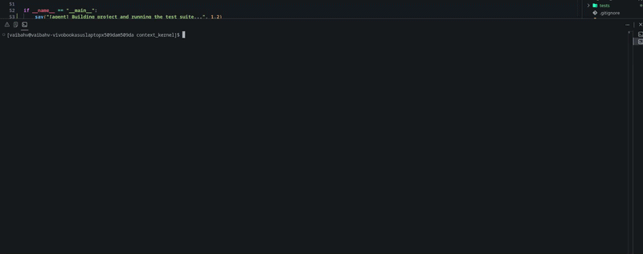
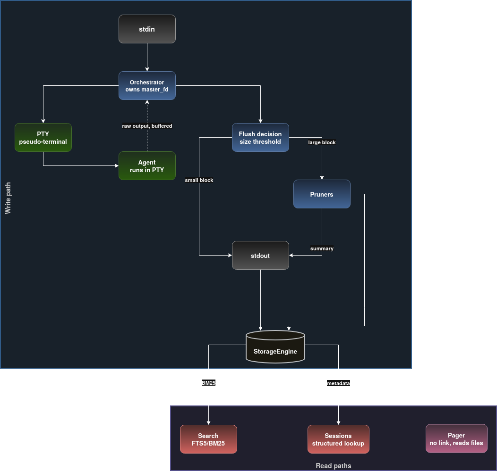

# ACK: Agent Context Kernel

**Intelligent memory middleware for terminal AI coding agents.**

ACK is a transparent proxy between you and any terminal AI agent (Aider, Claude Code, and others). It collapses the noisy, high-token output that pollutes the context window (stack traces, build-error walls, log floods) into its actionable signal, and archives the full untouched stream to a local searchable database.

Your agent sees the signal. The full log is one `ack recall` away — for you *and* the agent itself.

[](LICENSE)


---

<div align="center">



</div>

---

## Results

Measured on a realistic corpus of tracebacks, Rust/GCC builds, and log floods. No LLM in the loop, reproducible, and run in CI on every push.

| Suite | Token compression | Signature fidelity |
| --- | :---: | :---: |
| Python tracebacks | **93%** | **100%** |
| Rust + GCC builds | **91%** | **100%** |
| Log floods | **99%** | **100%** |
| Mixed realistic | **80%** | **100%** |
| **Global** | **~95%** | **100%** |

**62,772 of 66,158 corpus tokens removed with zero loss of error signatures.** Every exception class, error code, and `file:line` survives compression.

```bash
poetry run python scripts/run_benchmarks.py
```

---

## Why it matters

A single failed test can dump a 60-frame traceback. A broken build repeats the same `error[E0308]` once per crate. A runaway logger floods 400 identical lines. Those tokens do two costly things:

1. **They drown the signal** the model reasons over. The real information (one exception, two user frames, a unique error code) is tiny.
2. **They invalidate the prompt cache.** Inject a 2,000-token wall and the cached prefix shifts, so the next turn is recomputed from scratch: slower and more expensive.

ACK keeps the signal, drops the noise, and never loses the original. The pruning is regex/structural, deterministic, and free. There is no second LLM.

---

## How it works

ACK spawns your agent inside a real pseudo-terminal (`openpty` + `fork` + `setsid`), so prompts, colors, and cursor movement behave exactly as if you launched it directly. A single `select()` loop multiplexes your keyboard, the agent, the screen, and the database.




---

Every flushed buffer is handled in order:

1. **Small output passes through verbatim** (below `--prune-threshold`, default 30 lines).
2. **Interactive prompts are never pruned.** A `[Y/n]`, `(yes/no)`, or `Continue?` tail means the agent is waiting, so you always see it.
3. **Large blobs run through ordered pruners.** First match wins: a hit injects a compact summary, a miss passes through.
4. **Everything is persisted.** The summary is a view, never a deletion.

When a pruner fires you see exactly what happened — and a stable handle to page the original back:

```
[ACK] Compressed 63 lines → 4 lines  (recall: ack #42)
── Traceback ──
  at /app/src/views/checkout.py:201 in post
  at /app/src/models/cart.py:88 in checkout
  ↳ KeyError: 'card_token'
```

### Recall: the archive is readable, not just written

Pruning that you can't undo is just lossy compression. ACK stamps every pruned injection with a handle (`ack #42`) and exposes `ack recall` as a plain shell command — so when the summary isn't enough, the exact original bytes come back on demand, by handle or by search:

```bash
ack recall 42                     # page back the full log behind that banner
ack recall "card_token"           # or find it by content, scoped to this session
```

Because it's an ordinary command, the **agent** can run it too: it drops the 60-frame wall, keeps working from the summary, and pulls the verbatim detail back only if it actually needs it. A [benchmark](scripts/run_recall_benchmark.py) shows this recovers every dropped detail at ~80% fewer tokens than never pruning at all.

---

## Install

POSIX only (uses `pty`, `fork`, `termios`), Python 3.10+. macOS and Linux native; on Windows use WSL.

```bash
git clone https://github.com/Vaibhavtripathi7/context_kernel
cd context_kernel
poetry install        # or: pip install .
poetry run ack --help
```

`tree-sitter` powers `ack toc`; without it, ACK falls back to a regex parser automatically.

---

## Quick start

```bash
# Wrap any agent. Everything after `--` is the agent command.
ack run -- aider --model gpt-4o
ack run -- claude --dangerously-skip-permissions

# Search the full archive of every session (FTS5 syntax, BM25 ranked)
ack search "ImportError OR ModuleNotFoundError"

# Page a pruned log back — by its `ack #N` handle, or by content
ack recall 42
ack recall "ImportError"

# Symbol map of a file instead of dumping the whole thing
ack toc context_kernel/core/orchestrator.py

# Recent sessions
ack sessions
```

**Try it in 10 seconds, no agent required.** A bundled script emits a 200-line flood plus a deep traceback:

```bash
ack run -- python examples/crashing_agent.py
ack recall "KeyError"        # page the full traceback back by content
```

The flood collapses to a one-line frequency table, the traceback to its two user frames plus the exception, and the original is still recoverable verbatim. When the agent exits, ACK prints exactly what it saved:

```
[ACK] Session summary
  Chunks intercepted :        8
  Chunks pruned      :        4
  Tokens saved       :    3,438  (~97% of pruned output)
  Est. cost saved    : $   0.01  (at $3/M input tokens)
  Elapsed            :       6s
```

---

## What gets compressed

The built-in `ShellPruner` targets the three biggest offenders. The original bytes on disk are never modified.

| Input | Strategy | Result |
| --- | --- | --- |
| **Python tracebacks** | Keep the exception + 3 deepest user frames; drop stdlib/venv noise. Chained exceptions each summarized. | `── Traceback ──` with only the frames that matter. |
| **Rust / GCC / Clang errors** | Deduplicate by error code or diagnostic line; surface counts and the unique set. | `[Rust build: 32 errors → 8 unique]` |
| **Log floods** | Detect when one line dominates (≥ 60%) and replace it with a frequency table. | `× 400  WARNING:root:retrying…` |

---

## Use cases

- **Long refactors that hit failing tests.** The agent sees the exception and the 3 user frames it needs, not the 60-frame async wall.
- **Large Rust / C++ builds.** One type error re-emitted per crate becomes "8 unique errors," not 200 lines.
- **Noisy services.** Repetitive retry/heartbeat spam collapses to a frequency table so the rare line stays visible.
- **A searchable audit log.** `ack search` finds output across all sessions, weeks later, even after it scrolled off screen.

---

## Command reference

**`ack run -- <agent command>`**

| Option | Default | Description |
| --- | --- | --- |
| `--db PATH` | `~/.local/share/ack/kernel.db` | SQLite database path. |
| `--prune-threshold N` | `30` | Output lines buffered before pruners activate. |
| `--no-annotate` | off | Suppress the `[ACK]` banners. |
| `--tui` | off | Experimental Textual stats dashboard. |

**`ack search "<query>"`** takes an FTS5 expression (`AND`/`OR`/`NOT`, prefix, phrase) and ranks results by BM25. Options: `--session`, `--limit` (default 20), `--db`.

**`ack recall <id|query>`** pages a stored log back. A numeric argument is an `ack #N` handle (exact lookup); anything else is a search, scoped to the most recent session by default. Options: `--session`, `--all` (search every session), `--limit` (default 1), `--raw` (skip escape-sequence sanitisation), `--db`.

**`ack toc <file>`** prints a symbol table-of-contents (Python today).

**`ack sessions`** lists recent sessions. Options: `--limit`, `--db`.

---

## Architecture

No second LLM, no pipes (PTY only), no heavy database.

| Module | Responsibility |
| --- | --- |
| `core/orchestrator.py` | PTY spawn, `select()` loop, buffering, stream injection, raw/cooked mode, `SIGWINCH` forwarding. |
| `memory/storage.py` | SQLite (WAL) + FTS5 content table kept in sync by triggers (text stored once), BM25 search, per-session stats. |
| `memory/pager.py` | tree-sitter symbol mapper with regex fallback. |
| `pruners/base.py` | `BasePruner` ABC: cheap `matches()` gate + `compress()`. |
| `pruners/shell_pruner.py` | Built-in traceback / build-error / log-flood pruner. |
| `cli.py` | `click` CLI plus the experimental Textual dashboard. |

WAL mode lets the orchestrator write while readers query without blocking. The archive lives at `~/.local/share/ack/kernel.db` (override with `--db`).

---

## Writing your own pruner

```python
from context_kernel.pruners.base import BasePruner, PrunerMetadata


class MyPruner(BasePruner):
    metadata = PrunerMetadata(name="my_pruner", description="Collapses my tool's output")

    def matches(self, text: str) -> bool:
        return "my-pattern" in text          # cheap gate, runs on every flush

    def compress(self, text: str) -> str | None:
        return summarize(text)               # return a summary, or None to pass through
```

Register with `pruners=[MyPruner(), ShellPruner()]` on the `Orchestrator`. Pruners run in order; first non-`None` wins, so list specific pruners before general ones.

---

## Development

```bash
poetry install
poetry run pytest                        # 107 tests (unit + integration)
poetry run pytest -m "not integration"   # fast unit tests only
poetry run python scripts/run_benchmarks.py          # L1 compression / fidelity
poetry run python scripts/run_recall_benchmark.py    # L2 needle recovery
poetry run ruff check context_kernel scripts
poetry run mypy context_kernel           # strict
```

CI runs ruff, mypy `--strict`, the full suite, and the benchmark on every push and PR.

---

## Roadmap

ACK is one piece of a larger idea: treat the context window as a scarce resource
to be managed, and keep deterministic work out of the model's way. The pruner you
see today is the first of three layers.

- **L1 — output reduction** *(shipped).* The pruners. Collapse deterministic
  noise — tracebacks, build-error walls, log floods — to its signal before it
  ever reaches the model.
- **L2 — memory paging** *(in progress).* The archive plus `ack recall`. Pruned
  detail is recoverable on demand, so compression is never a one-way loss.
  Shipped: stable `ack #N` handles and recall by id or content. Next:
  - **Proactive dedup** — content-hash repeated output so the same error isn't re-paged across turns.
  - **Pager narrowing** — recall just the errored function, not the whole log.
  - **A context-health signal** — detect repetition and re-run-the-same-command loops as a deterministic paging trigger, instead of a fixed token threshold.
- **L3 — execution offload** *(exploring).* Run well-specified, deterministic
  sub-tasks outside the model entirely and hand back only the result.

Layers compound: L1 shrinks what enters the window, L2 makes that shrink safe to
undo, L3 keeps whole tasks out of the window to begin with. Issues and PRs
against any layer are welcome — see [CONTRIBUTING](CONTRIBUTING.md).

---

## Limitations

- **POSIX only** (uses `pty`/`fork`/`termios`); use WSL on Windows.
- **`ack toc` is Python-only** today; tree-sitter is structured to add languages.
- **`--tui` is experimental:** Textual and the PTY interceptor both want the terminal, so the agent runs non-interactively in that mode. Plain `ack run` is the recommended interactive path.
- **Heuristic by design.** Pruners are fast, deterministic, and free; a new output format needs a new pruner (easy to write, see above).

---

## License

[MIT](LICENSE) © Vaibhav Tripathi
